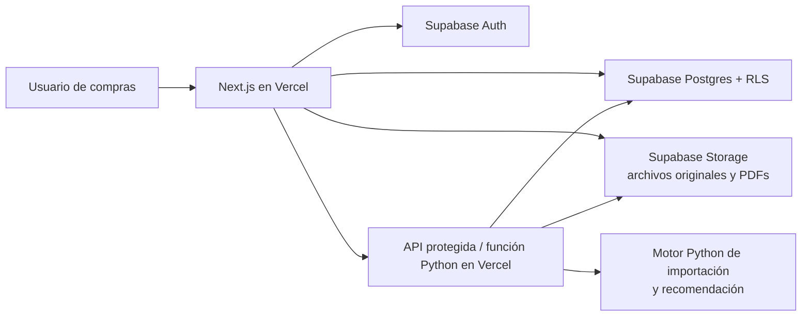

# Plan de migración: Programa de Compras Web

> **Estado:** borrador listo para validar antes de implementar.  
> **Última actualización:** 2026-08-18.  
> **Propósito:** reemplazar el MVP de Streamlit por una aplicación web persistente para el equipo de compras de Jugando y Educando.

Este documento es la fuente de contexto para cualquier persona o agente que continúe el trabajo. Antes de implementar, leer completo junto con `README.md`, `PRD_MVP_SOFTWARE_COMPRAS.md` y `procurement_engine.py`.

## 1. Decisiones ya tomadas

| Tema | Decisión |
| --- | --- |
| Aplicación web | **Next.js + TypeScript** con App Router. |
| Hosting | **Vercel** para producción y previews. |
| Base de datos y archivos | **Supabase**: Postgres, Auth, Storage y RLS. |
| Motor de cálculo | Python, refactorizado desde `procurement_engine.py`, expuesto inicialmente como función Python en Vercel. |
| Interfaz | Inspirada en el OMS de `/Users/alejomeek/Documents/oms-jugando-educando`; no se copia su código. |
| Navegación | Panel lateral persistente, con secciones de la aplicación y estado activo claro. |
| Excel | Deja de ser el centro del flujo. Puede haber exportación puntual, pero no un libro multihoja como mecanismo de edición. |
| Inventario | Se conserva como información de referencia; **nunca modifica la compra sugerida**. |
| Redistribución | Fuera de alcance: no CEDI→tienda, tienda→tienda ni entre ciudades. |

## 2. Resultado de negocio esperado

La persona de compras puede crear una corrida para un proveedor, cargar los archivos de TBC y la lista de precios, revisar el resultado en la aplicación, ajustar cantidades y emitir/guardar órdenes de compra por punto de entrega.

La regla central es deliberadamente simple:

```text
compra_sugerida = ceil((ventas_históricas / días_del_período) × días_objetivo)
```

Reglas innegociables de esta versión:

1. Si un producto no tuvo ventas históricas en un punto, la compra sugerida de ese punto es `0`.
2. El stock actual se muestra, pero no se resta, no se usa como mínimo ni cambia el resultado de la fórmula.
3. No hay mínimos por quiebre, compra por posible quiebre ni redistribuciones.
4. Las cantidades finales se editan y se guardan en la UI; la sugerencia original nunca se sobrescribe.
5. La orden conserva una fotografía de producto, costo, cantidades y usuario/fecha de emisión para que el histórico sea auditable.

## 3. Qué existe hoy y qué se aprovecha

El repositorio actual es un MVP Python + Streamlit. Sus piezas relevantes son:

| Archivo | Responsabilidad actual | Tratamiento en la migración |
| --- | --- | --- |
| `procurement_engine.py` | Lectura TBC, validación EAN, cruce proveedor, cálculo y Excel | Reutilizar los lectores y validaciones; sustituir el cálculo de necesidad y eliminar redistribución. |
| `app.py` | Pantallas Streamlit y carga de archivos | No se migra literalmente; sirve como inventario funcional de pantallas y campos. |
| `purchase_order_pdf.py` | PDF por punto y ZIP | Reutilizar diseño/datos útiles o reimplementar el render en el servicio de órdenes. |
| `test_procurement_engine.py` | Dos pruebas con archivos locales | Reemplazar por pruebas unitarias del nuevo algoritmo, importaciones y flujo de orden. |
| `PRD_MVP_SOFTWARE_COMPRAS.md` | Alcance histórico del MVP | Consultar solo para formatos TBC y reglas que no contradigan este plan. |

El motor actual también hace mínimos de quiebre, descuenta inventario, trata excedentes y mueve unidades entre CEDI, bodegas y tiendas. Esa lógica se debe eliminar del motor nuevo, no dejarla como código inactivo.

### Formatos de origen que deben seguir soportados

- `SDOSXSUC.CSV`: maestro TBC, EAN, comodín, PVP e inventario por ubicación.
- `INVEPTOS.XLS`: ventas por período, EAN, costo TBC y columnas `TISUC#` / `UNSUC#`.
- Lista de precios de proveedor: tanto la plantilla normalizada (`EAN-13`, `Nombre`, `Costo proveedor`) como la lista real de Spektra cuyo encabezado aparece varias filas abajo.

El EAN sigue siendo texto exacto: conserva ceros iniciales y solo se considera válido si contiene dígitos, sin espacios ni caracteres extraños. Las filas con EAN inválido o duplicado se conservan como incidencias de la importación y no se cruzan automáticamente.

## 4. Arquitectura objetivo



### Principios técnicos

- El navegador usa el cliente anónimo de Supabase solo con RLS activo. Nunca recibe `service_role` ni secretos de Vercel.
- Las operaciones privilegiadas —parsear archivos, crear corridas, emitir una orden, generar PDF— ocurren en rutas de servidor o en la función Python autenticada.
- Los archivos se cargan primero a un bucket privado; Postgres guarda metadatos, estado, incidencias y referencias de Storage.
- La base es la fuente de verdad. Un PDF o exportación es una representación, no el lugar donde se editan cantidades.
- Toda modificación material debe dejar `created_by`, `updated_by` o un evento de auditoría.

### Estructura recomendada del repositorio después del arranque

```text
programa-compras/
  app/                         # rutas y vistas Next.js
  components/                  # UI, tablas, formularios y layout
  lib/                         # cliente Supabase, validadores y utilidades TS
  api/                         # funciones Python que Vercel expone
  engine/                      # dominio Python sin Streamlit
    readers.py
    validation.py
    recommendation.py
    orders.py
  supabase/
    migrations/                # única fuente de verdad del esquema
    seed.sql                   # ubicaciones base para desarrollo
  tests/
    python/
    web/
  docs/
  PLAN_MIGRACION_COMPRAS_WEB.md
```

No introducir un segundo frontend ni una segunda base de datos. Si el procesamiento supera los límites prácticos de Vercel, se desplaza **solo** `engine/` a un servicio Python; Next.js, Supabase y el contrato de API se conservan.

## 5. Modelo de datos inicial

Se usarán UUID, `timestamptz`, `numeric(14,2)` para dinero, enteros para cantidades y llaves foráneas reales. Las migraciones se escriben en SQL y se aplican en orden.

| Tabla | Campos y restricciones esenciales | Responsabilidad |
| --- | --- | --- |
| `profiles` | `id` = `auth.users.id`, `full_name`, `role` (`admin`, `buyer`, `viewer`) | Identidad y permiso de negocio. |
| `locations` | `id`, `code` único, `name` único, `type`, `active`, `display_order` | Av. 19, Bulevar, Oviedo, Bvista, Calle 74 y CEDI. La referencia Full/Feria se modela si se requiere en importaciones, pero no como destino de compra. |
| `suppliers` | `id`, `name`, `tbc_code` de tres dígitos único, `active`, contacto opcional | Proveedor y comodín TBC. |
| `products` | `id`, `tbc_sku` único nullable, `ean` único nullable, `name`, `current_pvp`, `active` | Catálogo TBC normalizado. Un EAN inválido nunca crea un producto normalizado. |
| `supplier_products` | `supplier_id`, `product_id` nullable, `ean`, `supplier_name`, estado | Relación proveedor-producto; permite productos nuevos todavía sin SKU TBC. Unicidad por proveedor + EAN. |
| `price_lists` | `id`, `supplier_id`, `source_file_id`, `effective_date`, `status`, `imported_at` | Versión de una lista del proveedor. Nunca se actualiza una lista emitida; se crea versión nueva. |
| `price_list_items` | `price_list_id`, `supplier_product_id`, `ean`, `supplier_cost`, datos de origen | Precios por producto y base de comparación de costos. |
| `files` | `id`, `bucket`, `object_path`, `original_name`, `mime_type`, `size_bytes`, `sha256`, `uploaded_by` | Metadatos de todo archivo privado. |
| `import_jobs` | `id`, `type`, `supplier_id`, `file_id`, `status`, período detectado, conteos, error | Trazabilidad de carga: pendiente, procesando, listo o fallido. |
| `sales_imports` / `sales_lines` | cabecera de período y líneas por EAN/ubicación: unidades vendidas, costo TBC, datos fuente | Histórico normalizado desde INVEPTOS. Evitar duplicar un mismo proveedor/período sin decisión explícita. |
| `inventory_snapshots` / `inventory_lines` | fecha/cabecera y existencias por EAN/ubicación | Referencia visible desde SDOSXSUC; no participa en la fórmula. |
| `purchase_runs` | proveedor, importaciones usadas, parámetros, estado, `created_by`, fecha | Una ejecución reproducible del análisis. Debe guardar el período y los días objetivo usados. |
| `purchase_run_lines` | corrida + producto/EAN + ubicación, ventas, días, sugerencia, stock de referencia, costo, estado | Resultado inmutable de la fórmula más la cantidad final editable separada. Unicidad corrida + producto/EAN + ubicación. |
| `purchase_line_adjustments` | línea, cantidad anterior, cantidad nueva, motivo, usuario, fecha | Historial de cambios de cantidad final; no se pierde criterio humano. |
| `purchase_orders` | proveedor, ubicación destino, número único, estado (`draft`, `issued`, `cancelled`), fechas, PDF | Orden persistente, usualmente una por punto de entrega. |
| `purchase_order_items` | orden, línea de corrida opcional, SKU/EAN/nombre/costo/cantidad/foto de valores | Snapshot legal/operativo de la orden. |
| `audit_events` | actor, entidad, acción, payload mínimo, fecha | Auditoría transversal para emisiones, cambios y eliminaciones lógicas. |

### Vistas o consultas de lectura

- `latest_supplier_prices`: último precio válido por proveedor/EAN.
- `cost_changes`: último costo TBC disponible frente al último costo proveedor, con diferencia absoluta y porcentual.
- `purchase_run_summary`: totales por corrida, proveedor, punto, unidades y valor.
- `import_issues`: incidencias de calidad ligadas a archivo e importación.

Estas pueden comenzar como consultas de servidor. Convertirlas en vistas SQL solo cuando sus formas se estabilicen.

## 6. Algoritmo de recomendación nuevo

Para cada producto comprable, ubicación operativa y corrida:

```python
daily_sales = sales_units / period_days
suggested_quantity = ceil(daily_sales * target_days[location]) if sales_units > 0 else 0
```

Condiciones de elegibilidad:

1. El EAN es válido y único en la importación relevante.
2. El producto pertenece al proveedor por comodín TBC o existe como producto nuevo en una lista de ese proveedor.
3. Existe lista de precios válida para comprar. Para un producto nuevo sin historia TBC, la sugerencia inicial es `0`, pero el comprador puede agregarlo manualmente a una orden.
4. Los días de período se calculan inclusivamente: `FHASTA - FDESDE + 1`; si las fechas son inválidas, se bloquea esa importación.
5. El inventario puede adjuntarse a la línea como `stock_reference`, pero jamás entra al cálculo.

No crear campos de `objetivo`, `necesidad`, `excedente`, `redistribución recibida`, `mínimo por quiebre` ni transferencias en el dominio nuevo.

## 7. Experiencia de usuario y referencia visual OMS

La referencia visual es el proyecto en `/Users/alejomeek/Documents/oms-jugando-educando`, en particular `src/index.css`, `src/components/layout/AppLayout.tsx` y `src/components/layout/Sidebar.tsx`.

### Sistema visual que se adopta

- Fuente principal: **Plus Jakarta Sans**. Cargarla con `next/font/google`; no depender de una fuente ya instalada en el equipo del usuario.
- Paleta: fondo gris-azulado muy claro, superficies blancas, texto azul marino oscuro, azul vivo como acción primaria y bordes suaves azul-gris. Mantener los tokens de color, radios de `10px` aproximados y jerarquía visual del OMS.
- Componentes: Tailwind CSS v4 + shadcn/ui + Lucide. No copiar componentes del OMS; recrear los patrones necesarios en Next.js.
- Layout: sidebar blanca fija de ancho cercano a 240px, logo arriba, navegación con iconos, botón activo azul, estado de conexión y perfil/salida abajo. En móvil se convierte en `Sheet`/drawer.
- Contenido: área principal con encabezado compacto, título, contexto de proveedor/período, acciones a la derecha y tablas con filtros pegajosos.
- Accesibilidad: contraste AA, indicadores de foco, acciones no dependientes solo del color, tablas navegables y mensajes de error explícitos.

### Rutas iniciales

| Ruta | Menú | Objetivo |
| --- | --- | --- |
| `/dashboard` | Inicio | Indicadores: corridas recientes, órdenes por estado, cambios de costo e importaciones que requieren atención. |
| `/suppliers` | Proveedores | Crear/editar proveedor y consultar sus listas de precios/versiones. |
| `/imports` | Importaciones | Cargar SDOSXSUC, INVEPTOS o lista proveedor; ver procesamiento e incidencias. |
| `/purchase-runs` | Compras sugeridas | Crear corrida, elegir proveedor y fuentes; consultar, filtrar y ajustar sugerencias. |
| `/purchase-runs/[id]` | Detalle de compra | Tabla por producto y punto: ventas, días objetivo, compra sugerida, cantidad final, costo, stock de referencia y alertas. |
| `/orders` | Órdenes de compra | Borradores, emitidas, PDF, valor total y estado. |
| `/cost-changes` | Cambios de costo | Comparación de costo proveedor contra último costo TBC. |
| `/catalog` | Catálogo e incidencias | Productos nuevos, descontinuados/no encontrados y problemas de EAN/archivo. |
| `/settings` | Configuración | Ubicaciones, días objetivo predeterminados y administración de usuarios. Solo administrador. |

### Flujo principal en UI

1. El comprador entra a **Importaciones** y carga o selecciona una fuente ya vigente.
2. La app muestra fecha/período detectado, filas válidas, incidencias y costo/ventas disponibles.
3. En **Compras sugeridas**, elige proveedor, importación de ventas, lista de precios e inventario de referencia opcional.
4. La app crea la corrida y muestra las líneas calculadas sin modificar su sugerencia original.
5. El comprador filtra, edita `cantidad final`, añade nuevos productos si hace falta y deja motivo para cambios relevantes.
6. Selecciona líneas y crea borradores de órdenes por ubicación.
7. Revisa cada orden, la emite y descarga/consulta su PDF guardado.

## 8. Importación, validación y persistencia

### Contrato del procesamiento

1. El frontend solicita URL firmada o carga autenticada al bucket privado correspondiente.
2. Se crea `files` e `import_jobs` en estado `pending`.
3. El servicio Python lee el objeto, valida columnas y estructura, y normaliza solo filas utilizables.
4. El proceso guarda filas válidas en una transacción y las incidencias asociadas; actualiza el trabajo a `completed`.
5. Ante falla, no deja una importación parcial como vigente: marca `failed`, mantiene el archivo y registra el error legible.

### Validaciones que se preservan

- Comodín de proveedor: exactamente tres dígitos después de punto en `Codea2` / `COMODI`.
- EAN: texto numérico exacto, sin limpieza silenciosa.
- Duplicado de EAN: incidencia y exclusión del cruce automático.
- Lista proveedor: EAN, nombre y costo requeridos; soportar búsqueda del encabezado real en filas iniciales.
- Ventas: una fecha inicial y final coherente, EAN y columnas requeridas.
- Cantidades: enteros no negativos en órdenes; dinero numérico no negativo.

### Regla de historial

No sobrescribir importaciones ya usadas en una corrida emitida. Si llega un archivo actualizado, se crea una importación/versionado nuevo. Una corrida conserva las referencias de las fuentes específicas con las que fue calculada.

## 9. Órdenes de compra

- Una corrida puede producir una o varias órdenes de compra; la agrupación predeterminada será proveedor + ubicación destino.
- Se puede guardar un borrador, volver a editarlo y emitirlo solo cuando esté revisado.
- Al emitir, se genera número único, PDF y eventos de auditoría. Cambiar una orden emitida requiere crear una revisión o cancelarla; no editar silenciosamente sus líneas.
- El PDF debe conservar la identidad de Didácticos Jugando y Educando, fecha, proveedor, destino, líneas, costo unitario, total por línea, total de unidades, total de compra y notas.
- Antes de migrar el diseño actual del PDF, confirmar si se requiere IVA, flete, vencimiento y condiciones de pago. El PDF actual de órdenes no los incorpora, mientras que la cotización de referencia `COT-MED-0073.pdf` sí los muestra.

## 10. Autorización y seguridad

| Rol | Permisos iniciales |
| --- | --- |
| `admin` | Usuarios, configuración, proveedores, importaciones, corridas y órdenes. |
| `buyer` | Ver catálogo/proveedores, importar, crear/editar corridas, ajustar líneas y emitir órdenes. |
| `viewer` | Solo lectura de datos, corridas y PDFs permitidos. |

Implementar RLS desde la primera migración, incluso si inicialmente todas las personas internas pueden consultar los mismos proveedores. Las políticas deben negar por defecto, usar `auth.uid()` y no confiar en que ocultar un botón sea seguridad.

Buckets privados sugeridos:

- `source-files`: CSV/XLS/XLSX originales.
- `purchase-order-pdfs`: PDF emitidos.
- `exports`: descargas temporales, si se habilitan.

Usar URLs firmadas de duración corta. Guardar hash de archivo para detectar carga accidental repetida. Registrar exclusivamente metadatos operativos; no poner secretos, tokens ni archivos de credenciales en Storage.

## 11. Despliegue en Vercel

Sí: la aplicación se desplegará en **Vercel**.

La plataforma soporta Next.js y también funciones Python; estas últimas aceptan dependencias declaradas en `requirements.txt` o `pyproject.toml`. En Vercel Pro, las funciones Node y Python pueden configurarse hasta 800 segundos, pero eso no reemplaza un worker para trabajos largos. [Runtimes de Vercel](https://vercel.com/docs/functions/runtimes) · [Python runtime](https://vercel.com/docs/functions/runtimes/python) · [límites](https://vercel.com/docs/functions/limitations)

Configuración inicial:

1. Crear proyecto Vercel conectado al repositorio y activar previews por pull request.
2. Configurar las variables de entorno de Supabase por ambiente (`development`, `preview`, `production`).
3. Crear un proyecto Supabase separado para desarrollo y otro para producción; aplicar migraciones con CI, nunca manualmente sin registrar SQL.
4. Elegir región de Vercel próxima a la región de Supabase para reducir latencia.
5. Configurar tamaño/memoria y duración explícita de la función de importación; limitar el tamaño de archivos permitido.
6. Excluir muestras, PDFs, pruebas y archivos de desarrollo del bundle Python.
7. Implementar logging estructurado, alertas de errores y un endpoint de salud interno.

**Criterio para pasar el motor a Railway/Render/Fly.io:** solo si archivos reales o concurrencia causan timeouts, bundle excesivo, consumo sostenido alto o requieren una cola de trabajos persistente. Ese cambio conserva la misma API, Storage y esquema.

## 12. Fases de implementación

### Fase 0 — Fundación y decisiones finales

- Crear rama y convertir este documento en punto de entrada de `README`.
- Inicializar Next.js, TypeScript, Tailwind, shadcn/ui, linting, pruebas y `.env.example` sin secretos.
- Crear proyecto Supabase de desarrollo, CLI, estructura de migraciones y tipos generados.
- Implementar Auth, `profiles`, roles y layout del OMS con rutas protegidas.
- Definir datos de prueba mínimos, sin copiar archivos comerciales al repositorio.

**Termina cuando:** un usuario autenticado ve sidebar, nombre de la app, rutas vacías protegidas y una política RLS de prueba comprobada.

### Fase 1 — Catálogo, proveedor y precios

- Migraciones de `locations`, `suppliers`, `products`, `supplier_products`, `files`, `price_lists` y `price_list_items`.
- UI de proveedores y carga/versionado de lista de precios.
- Parser Python de lista normalizada y lista Spektra real; incidencias visibles.
- Vista de productos nuevos, producto no encontrado y cambios de costo base.

**Termina cuando:** se puede importar una lista de proveedor, consultar su versión y encontrar el precio vigente por EAN de forma segura.

### Fase 2 — Ventas, inventario de referencia y calidad de datos

- Migraciones y parsers de `sales_imports/sales_lines` e `inventory_snapshots/inventory_lines`.
- UI de importaciones con progreso, períodos detectados, conteos e incidencias.
- Validación de comodín, fechas, EAN, columnas dinámicas de ubicaciones y duplicados.
- Catálogo TBC a partir de SDOSXSUC, sin borrar productos históricos.

**Termina cuando:** los tres archivos se procesan y las incidencias se pueden rastrear hasta archivo y fila, sin que una importación fallida afecte datos vigentes.

### Fase 3 — Compras sugeridas y ajustes

- Migraciones de `purchase_runs`, `purchase_run_lines` y `purchase_line_adjustments`.
- Motor Python puro con la fórmula nueva; sin inventario, mínimos ni redistribución.
- UI para crear corrida y tabla virtualizada/filtrable por SKU, EAN, producto, punto, sugerencia y alertas.
- Edición guardada de cantidades finales, con auditoría y protección ante concurrencia (`updated_at` o versión de fila).

**Termina cuando:** una corrida repetida con las mismas fuentes y parámetros produce el mismo resultado y cada cambio humano queda registrado.

### Fase 4 — Órdenes y documentos

- Migraciones de órdenes, líneas y eventos.
- Crear borradores por ubicación desde cantidades finales; permitir añadir producto nuevo manualmente.
- Revisión, emisión, numeración, PDF almacenado y descarga autenticada.
- Dashboard con órdenes recientes, valor, unidades y pendientes de revisión.

**Termina cuando:** una orden emitida se puede volver a consultar con exactamente las líneas, costos y cantidades que tuvo al emitirse.

### Fase 5 — Endurecimiento y salida a producción

- Pruebas de permisos, importaciones, cálculo, PDF y rutas críticas.
- Migración de datos solo si se decide que los archivos/muestras históricas tienen valor operativo; de lo contrario se inicia con primera carga oficial.
- Revisión de RLS, secretos, límites de upload, logs, backups y recuperación.
- Prueba de usuario con compras; ajustes de experiencia y manual de uso web.

**Termina cuando:** un comprador puede completar el flujo sin Streamlit y un administrador puede auditar importación, cálculo, ajuste y orden.

## 13. Pruebas y criterios de calidad

| Área | Pruebas obligatorias |
| --- | --- |
| Fórmula | ventas positivas con redondeo, ventas cero, días distintos, cada ubicación y ausencia de inventario. |
| No regresión | demostrar que cambiar `stock_reference` no cambia la sugerencia. |
| Importación | cabecera Spektra desplazada, CSV Latin-1, EAN con cero inicial, EAN inválido, duplicado, comodín inválido y fecha inválida. |
| Persistencia | corrida reproducible, historial de ajuste y snapshot de orden emitida. |
| Seguridad | usuario no autenticado, `viewer`, `buyer`, `admin`, acceso a Storage y RLS directa. |
| UI | filtros, estado vacío, carga/fallo, móvil con sidebar-drawer y tablas grandes. |
| PDF | subtotal/totales, datos de proveedor/destino y acceso únicamente por URL firmada. |

El CI debe ejecutar lint, comprobación de tipos, pruebas unitarias Python y TypeScript, y migraciones contra una base efímera o de integración. Cada PR debe crear preview de Vercel.

## 14. Fuera de alcance explícito

- Integración directa y en tiempo real con TBC o proveedores.
- Redistribución de inventario de cualquier clase.
- Ajustar compra por stock, mínimos de quiebre o reglas de excedentes.
- Recomendación automática de PVP, margen o múltiplos de empaque.
- Edición de órdenes emitidas sin una revisión trazable.
- Sustituir el OMS actual; este proyecto toma su lenguaje visual, no su responsabilidad operativa.

## 15. Decisiones que conviene confirmar antes de Fase 3

No bloquean la fundación, catálogo ni importaciones. Sí deben quedar cerradas antes de liberar compras sugeridas:

1. **Full Mercado Libre:** ¿sus ventas continúan sumándose a CEDI como hace el MVP, o dejan de participar totalmente en la compra nueva? La recomendación provisional es conservar esa suma mientras se siga cargando esa demanda al CEDI.
2. **Días objetivo:** ¿se configuran por ubicación globalmente, por proveedor, o por corrida? La propuesta: configuración global por ubicación, editable en cada corrida, guardando la fotografía usada.
3. **Productos nuevos:** confirmar si se podrán agregar manualmente a una orden desde el primer lanzamiento (recomendado) y si requieren aprobación previa.
4. **Numeración y PDF de OC:** confirmar formato oficial del consecutivo, si requiere IVA/flete/vencimiento/condiciones y si una OC se envía por punto o se consolida por proveedor.
5. **Usuarios:** confirmar los usuarios iniciales y si todos los compradores ven todos los proveedores/órdenes o existen restricciones por persona/equipo.
6. **Vigencia de archivos TBC:** definir qué período es válido para una corrida y si se permite elegir entre múltiples importaciones históricas.

## 16. Instrucciones para un agente que retome el trabajo

1. Leer este plan y confirmar que no haya una decisión posterior que lo contradiga.
2. Consultar primero los formatos reales en el repositorio actual; nunca asumir que todas las listas de proveedores llegan con el mismo encabezado.
3. Antes de tocar el motor, escribir las pruebas de la fórmula nueva. No portar las reglas de redistribución por accidente.
4. Antes de exponer una tabla en el navegador, crear su migración, RLS y tipos TypeScript.
5. Mantener `supabase/migrations/` como única fuente de verdad del esquema; no editar producción manualmente.
6. Reutilizar la identidad visual del OMS de forma consciente: Plus Jakarta Sans, tokens azul/gris y navegación lateral, sin copiar su código, secretos ni reglas de negocio.
7. No subir archivos comerciales locales, claves ni salidas de producción al repositorio.
8. Al cerrar cada fase, actualizar este documento con decisiones, rutas implementadas, migraciones relevantes y cualquier cambio de alcance.
